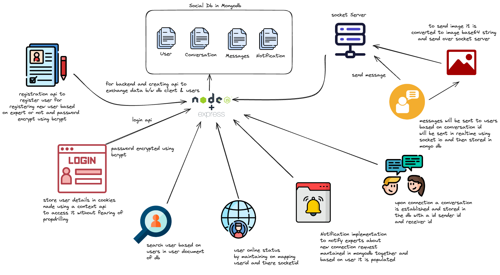

# Real Time Chat Application
## Video Demo


https://github.com/sayandeeps/Realtime-Chat-Application/assets/89361557/43d19938-7a31-40d4-a893-19f7e06deabc


 

## High Level Representation of the Project 



This is a comprehensive documentation of the backend and frontend code for a chat application.

## Tech Stack
       
 

## Backend

The backend is built using Node.js, Express.js, and MongoDB. It consists of several API endpoints for handling user authentication, conversation management, and message exchange.

### API Endpoints

- Register: Creates a new user account.
- Login: Authenticates a user and returns the user details.
- Create Conversation: Creates a new conversation between two users.
- Get Conversations: Retrieves a list of conversations for a user.
- Get Messages: Retrieves a list of messages for a conversation. Pagination concept is used where number of messages fetched is based on limit given and based on that pages is calculated there is a next page and previous page atrributs that helps us understand if more messages are there or not. 
- Send Message: Sends a new message to a conversation.
- Update User: Updates a user's profile information.
- Delete User: Deletes a user account.
- get Notification: get gotifications for a user 
- send notification: based on to send id of user and from id user 

## Frontend

The frontend is built using Next.js, React, and Tailwind CSS. It consists of several components for handling user authentication, conversation management, and message exchange.

### Components

- Navbar: A navigation bar component that displays the user's profile information and logout button.
- ChatMenu: A component that displays a list of conversations for a user and based on available users in socket server green indicator is given.
- ChatEntry: A component that displays a single conversation entry.
- ChatBox: A component that displays the chat interface for a conversation. 10 messages are initially loaded and based on scroll behaviour more messages are loaded by dynamically calculating page number which is then send to fetch messagesapi
- Message: A component that displays a single message different color based on sender and receiver and also time stamp formatted to show time as in famous chat apps.
- Searchbox: A component that allows users to search for other users.
Sheettest: A component that displays a list of online users.
- Modal: A component that displays a modal window for  user profile information.

## Features

- **Real-time Messaging** : The application uses WebSockets by socket io to enable real-time messaging between users andthe messagesn are also stored in mongodb from where we can retrieve the history
- **Conversation Management**: The application allows users to create, manage, and delete conversations.
- **User Authentication**: The application uses context api to check for authenticate users and provide user access to protected routes and components avoiding prop drilling .
- **Search Functionality**: The application allows users to search for other users by username .
- **Online User Indicators**: The application displays online user indicators to show which users are currently online.
- **Send Images**: Send over socket io and store in mongodb as Image Base64 string

## Challenges

- Scalability: The application may need to be optimized for scalability to handle a large number of users and conversations. Where we can user cache techniques to optimize it
- Security: The application may need to be secured against potential security threats, such as SQL injection and cross-site scripting (XSS) attacks.
- Performance: The application may need to be optimized for performance to ensure fast and responsive user interactions.
- Media Transfer: Currently only base64 encoded image string supported the strings are too large and not efficient to store we can use storage solutions like s3 bucket and we can support wide rage of medias like image, videos, file, etc.


**Links of the vercel deployment** 
``` java
for backend
https://apichatbackend.vercel.app

for frontend
https://client-sayandeeps-sayandeeps-projects.vercel.app

```

> Currently deployed in vercel the client and backend part but socket server cant be deployed in vercel we will need aws or similar server. 

> As we are using vercel free tierthe apis are too slowto be used so advisable to use in localhost later we can dockerize it and create a cicd pipely to deploy it in an EC2 instance in AWS or similar 
